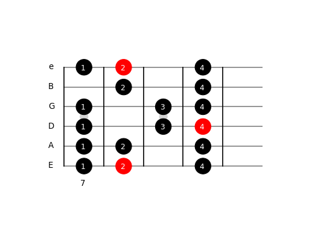

# PyFreatboard

PyFreatboard is an API for drawing diagrams (aka shapes) on the guitar freatboard using Python as well as to automatically generate new shapes. 
It uses Matplotlib as a background plotting engine and the automatically generated shapes follow (to some extent) the Berklee fingering style.

For more information about how to use it check the [tutorial](tutorial.ipynb) included.

*Narcís Palomeras*